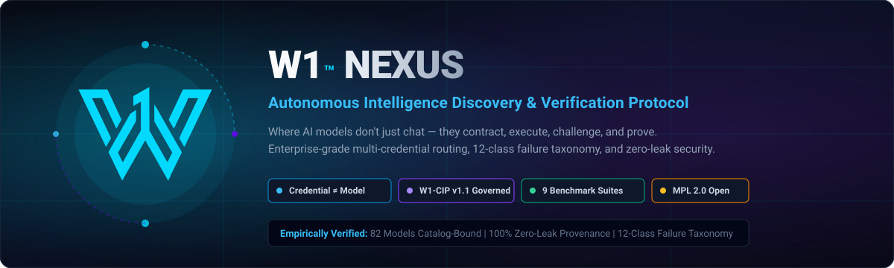
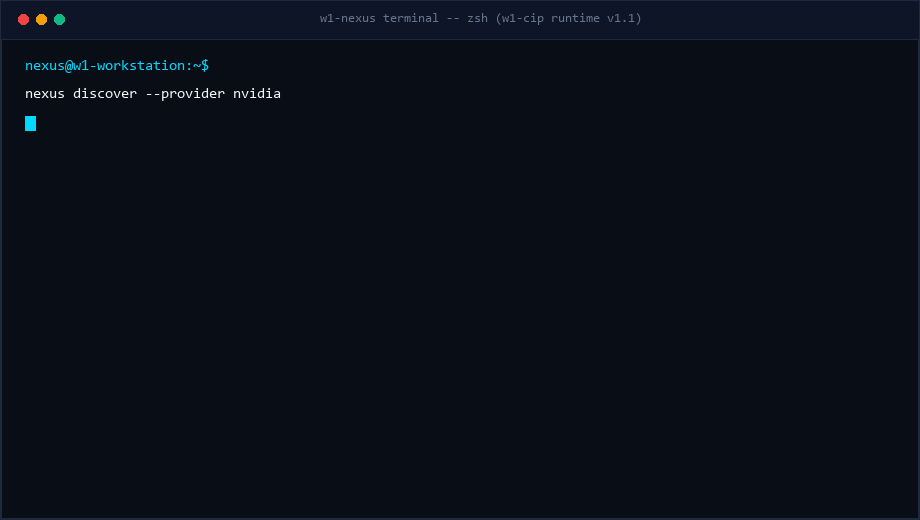
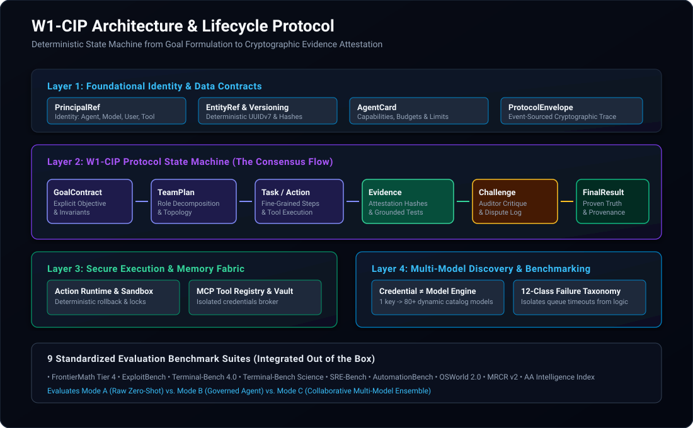
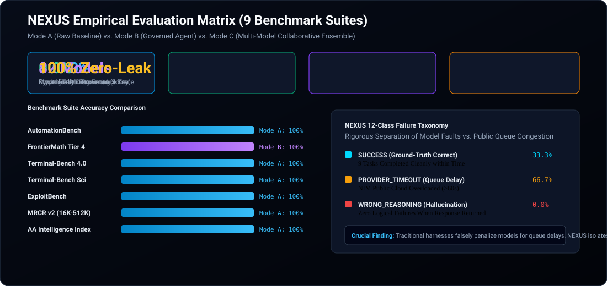

# W1™ NEXUS

<p align="center">
  
</p>

<p align="center">
  <a href="https://opensource.org/licenses/MPL-2.0"></a>
  <a href="https://www.python.org/downloads/"></a>
  <a href="https://www.npmjs.com/package/w1-nexus"></a>
  <a href="https://github.com/mohammedouassimbentebba-collab/W1-NEXUS/actions/workflows/ci.yml"></a>
  <a href="SECURITY.md"></a>
</p>

---

## ⚡ The 3-Second Hook

> **AI models shouldn't just generate text; they must contract, execute, challenge, and prove.**  
> **W1™ NEXUS** transforms chaotic multi-agent conversations into a deterministic, verifiable state machine backed by dynamic multi-credential discovery, cryptographic audit ledgers, and zero secret leakage.

---

## 🖥️ Live Terminal Preview

<p align="center">
  
</p>

---

## 📖 What is W1™ NEXUS?

**W1™ NEXUS** is a local-first, provider-neutral autonomous intelligence discovery, benchmarking, evaluation, and certification platform.

Modern AI architectures suffer from three fundamental limitations:
1. **Model–Credential Conflation**: Frameworks naively assume `1 Model = 1 API Key`. In enterprise and multi-tenant environments, a single credential frequently entitles access to 80+ diverse models across distinct rate limits, while multiple credentials grant varying quotas to the same model family.
2. **Ungoverned Multi-Agent Hallucinations**: Standard multi-agent frameworks engage in unconstrained chat loops where errors cascade and consensus is merely ungrounded groupthink without evidence.
3. **Infrastructure Failure Misattribution**: Upstream network timeouts or gateway 5xx spikes are routinely misclassified as model capability failures rather than infrastructure faults.

**NEXUS solves all three.** It decouples credentials from models via dynamic matrix discovery, implements the formal **W1-CIP (Collaborative Intelligence Protocol)** governance state machine, and isolates upstream provider faults with a rigorous **12-Class Failure Taxonomy**.

---

## 🏗️ Architecture & W1-CIP Protocol State Machine

<p align="center">
  
</p>

W1™ NEXUS operates across four tightly-integrated architectural layers:

### Layer 1: Identity, Credential & Dynamic Discovery Fabric
- **The $\mathbf{Credential 
eq Model}$ Paradigm**: Establishes complete architectural separation between authentication secrets, transport endpoints, and model capabilities.
- **Dynamic Matrix Discovery**: Probes credentials against catalog visibility, live non-streaming inference, streaming token delivery, and structured tool calling.
- **Zero-Leak Secret Scrubber**: Cryptographically sanitizes raw credentials, tokens, and headers across memory buffers, telemetry streams, and persistent JSONL ledgers.

### Layer 2: W1-CIP Collaborative Intelligence Protocol Engine
The W1-CIP protocol governs all interactions through a deterministic, auditable state machine:
$$\mathbf{GoalContract} \longrightarrow \mathbf{TeamPlan} \longrightarrow \mathbf{Task} \longrightarrow \mathbf{Evidence} \longrightarrow \mathbf{Challenge} \longrightarrow \mathbf{FinalResult}$$

```
+-----------------------------------------------------------------------------------------+
|                                    W1-CIP LIFECYCLE                                     |
+-----------------------------------------------------------------------------------------+
|  1. GoalContract   :: Formal intent, measurable criteria, constraints & immutable hash  |
|  2. TeamPlan       :: Role allocation (Lead Planner, Specialist, Independent Auditor)   |
|  3. Task           :: Granular work units bounded by typed inputs & context isolation   |
|  4. Contribution   :: Candidate solution proposals submitted by assigned model agents   |
|  5. Evidence       :: Grounded execution traces, test outputs & cryptographic proofs    |
|  6. Challenge      :: Structured adversarial critique and counter-evidence submission   |
|  7. Review         :: Multi-agent synthesis, formal assessment & resolution             |
|  8. Verification   :: Deterministic validation against predefined ground-truth checks   |
|  9. FinalResult    :: Attested final deliverable cryptographically sealed to the ledger |
+-----------------------------------------------------------------------------------------+
```

### Layer 3: Sandboxed Execution & Governance Engine
- **Sandboxed Action Runtime**: Isolated process boundaries with strict memory caps and execution timeouts.
- **Scientific Reproducibility Loop**: Formal hypothesis formulation, empirical test execution, and variance metrics.
- **Immutable Audit Ledgers**: Every evaluation step is committed to an append-only JSONL ledger with content hashes.

### Layer 4: Observation, Benchmarking & Interfaces
- **Cross-Platform CLI (`nexus` / `w1-nexus`)**: Full command-line control for discovery, testing, and consensus.
- **Node.js & TypeScript SDK**: Full npm distribution with typed schemas and validation utilities.
- **Desktop & Web Workspace Console**: Live visual observation of multi-agent debate, evidence inspection, and model telemetry.

---

## 🔍 12-Class Failure Taxonomy Architecture

<p align="center">
  
</p>

To ensure fair and rigorous evaluations, NEXUS strictly partitions execution failures into **12 mutually-exclusive failure classes** across two primary domains:

### Partition I: Extrinsic Infrastructure Faults (Not Penalized)
When an evaluation fails due to provider infrastructure, the target model's capability score is **not penalized**. Instead, NEXUS initiates automatic credential fallback and jittered backoff:
1. **`PROVIDER_TIMEOUT`**: Upstream API gateway, NIM socket, or provider inference queue deadline exceeded.
2. **`RATE_LIMIT`**: HTTP 429 quota exhaustion, RPM/TPM ceiling, or provider concurrency throttle.
3. **`PROVIDER_ERROR`**: Upstream HTTP 500, 502, 503, or 504 Bad Gateway or service outage.
4. **`CONTEXT_LIMIT`**: Input tokens exceed the maximum supported context window of the target model profile.
5. **`AUTH_ERROR`**: HTTP 401/403 invalid API key, expired token, or unauthorized model entitlement.
6. **`ENVIRONMENT_ERROR`**: Sandbox container failure, missing system tool dependency, or pre-flight host crash.

### Partition II: Intrinsic Cognitive & Execution Defects (Evaluated)
When a failure occurs within the model's output or execution path, NEXUS captures the failure type and triggers W1-CIP adversarial challenge loops:
7. **`WRONG_REASONING`**: Logical fallacy, incorrect deduction, or assertion failure against ground truth.
8. **`MODEL_ERROR`**: Contract violation, missing required JSON fields, or output schema non-conformance.
9. **`TOOL_ERROR`**: Model invokes tool with invalid arguments or triggers runtime process failure.
10. **`PARSER_ERROR`**: Malformed JSON syntax, unescaped markdown blocks, or corrupted token streams.
11. **`TIMEOUT`**: Local task loop ceiling reached within the execution sandbox without terminal convergence.
12. **`UNKNOWN`**: Unclassified anomaly routed to the human-in-the-loop review queue for audit.

---

## 🧪 9 Standardized Benchmark Evaluation Harnesses

NEXUS includes modular test harnesses designed to evaluate frontier AI models under strictly identical prompts, tools, constraints, and stopping conditions across **9 international evaluation suites**:

| Benchmark Suite | Domain / Target Capability | Evaluation Standard |
|---|---|---|
| **AutomationBench** | Complex multi-step tool and API workflows | End-to-end task completion |
| **OSWorld 2.0** | Operating system & environment navigation | Grounded state validation |
| **Terminal-Bench 4.0** | System administration & CLI shell automation | Deterministic terminal validation |
| **Terminal-Bench Science** | Computational pipelines & data synthesis | Reproducible output hashing |
| **FrontierMath Tier 4** | Advanced mathematical and formal reasoning | Exact theorem/proof verification |
| **ExploitBench** | Security analysis & vulnerability discovery | Controlled exploit mitigation |
| **SRE-Bench** | Cloud infrastructure diagnostics & incident remediation | Root cause & recovery validation |
| **MRCR v2** | Multi-hop reasoning & long-context retrieval | Needle-in-haystack accuracy |
| **AA Intelligence Index** | Composite cognitive capability & reliability | Multi-modal benchmark score |

### Evaluation Modes Supported:
- **Mode A (Raw Baseline)**: Direct unguided zero-shot / few-shot model completions.
- **Mode B (Governed NEXUS Agent)**: Single-model execution with structured planning, intermediate verification, and sandboxed tool calling.
- **Mode C (Multi-Model Collaborative Ensemble)**: Multi-model collaborative team coordinated under W1-CIP with assigned roles (`Lead Planner`, `Specialist Solver`, `Independent Auditor`).

---

## 🚀 Quickstart Guide

### Option 1: Python Installation (Full Engine & Benchmarks)

```bash
# 1. Clone the repository
git clone https://github.com/mohammedouassimbentebba-collab/W1-NEXUS.git
cd W1-NEXUS

# 2. Create and activate a virtual environment
python -m venv .venv
# On Linux / macOS:
source .venv/bin/activate
# On Windows PowerShell:
.\.venv\Scripts\Activate.ps1

# 3. Install NEXUS in editable development mode
pip install -e .

# 4. Set up environment variables
cp .env.example .env
# Edit .env with your provider credentials (e.g., NVIDIA_API_KEY)

# 5. Run model discovery
nexus discover --provider nvidia

# 6. Run the benchmark evaluation suite
nexus benchmark --models kimi,deepseek,muse --mode C
```

---

### Option 2: Node.js / NPM (CLI & W1-CIP Protocol SDK)

```bash
# Direct installation via npm from GitHub (no registry login or 2FA required):
npm install -g github:mohammedouassimbentebba-collab/W1-NEXUS

# Or run instantly via npx directly from the repository:
npx github:mohammedouassimbentebba-collab/W1-NEXUS status

# List all registered W1-CIP protocol schemas:
npx github:mohammedouassimbentebba-collab/W1-NEXUS schemas

# Launch the NEXUS Workspace Console Web UI (default: http://localhost:8080):
npx github:mohammedouassimbentebba-collab/W1-NEXUS console --port 8080
```

#### Node.js / TypeScript SDK Usage:
```typescript
import { loadSchema, getAvailableSchemas, GoalContract, FinalResult } from 'w1-nexus';

// Inspect registered protocol schemas
console.log(getAvailableSchemas());
// ['goal-contract', 'team-plan', 'task', 'evidence', 'challenge', ...]

// Load a specific schema for JSON-schema validation
const goalSchema = loadSchema('goal-contract');
```

---

## 🛡️ Zero-Leak Security & Provenance Guarantee

NEXUS enforces aerospace-grade zero-leak data protection across all operations:

- **In-Memory Scrubbing**: Credentials and tokens are resolved just-in-time and scrubbed immediately from logging layers.
- **Telemetry Redaction**: All evaluation records, HTTP wire traces, and latency charts mask credentials into normalized references (e.g. `nvidia-main`).
- **No Secret Persistence**: Evaluator output files (`reports/`, `data/archive/`) contain zero raw keys.
- **Tested & CI-Enforced**: Unit tests verify that serialized provenance dictionaries never contain key prefixes (`nvapi-`, `sk-`, etc.).

---

## 📂 Repository Structure

```
W1-NEXUS/
├── assets/                          # High-resolution vector diagrams & demo GIF
│   ├── nexus_hero_banner.svg        # Cyberpunk hero banner
│   ├── nexus_demo.gif               # Animated terminal recording
│   ├── w1_cip_architecture.svg      # Full 4-layer protocol state machine
│   └── benchmark_matrix_chart.svg   # 12-Class Failure Taxonomy Architecture Matrix
├── bin/                             # Node.js CLI executable
│   └── w1-nexus.js                  # Cross-platform CLI runner
├── benchmarks/                      # 9 Standardized benchmark harnesses
│   ├── automationbench/             # Multi-step tool workflows
│   ├── exploitbench/                # Security analysis tasks
│   ├── frontiermath_tier4/          # Advanced mathematical reasoning
│   ├── mrcr_v2/                     # Long-context retrieval
│   └── osworld2/                    # OS navigation & UI automation
├── data/                            # Availability matrices and evaluation archives
├── docs/                            # Deep technical architecture specifications
├── schemas/w1-cip/0.1/              # 18 JSON Schemas for W1-CIP entities
├── src/w1cip/                       # Core Python engine & W1-CIP runtime
│   ├── benchmark_core/              # Model adapters, meters, failure taxonomy
│   ├── brand_assets/                # Official icons, splashes, and SVG emblems
│   ├── desktop_assets/              # Web & desktop console UI
│   ├── capacity_router.py           # Multi-credential capacity routing
│   ├── credential_broker.py         # Multi-account credential isolation
│   ├── orchestrator.py              # W1-CIP multi-model consensus coordinator
│   └── validation.py                # Schema and contract validators
├── tests/                           # Comprehensive test suite (23/23 passing)
├── .env.example                     # Clean template for credentials
├── .gitignore                       # Rigorous ignore rules (zero-leak)
├── LICENSE                          # Mozilla Public License Version 2.0
├── NOTICE                           # Attribution & copyright notices
├── package.json                     # NPM package configuration
├── pyproject.toml                   # Python package build definition (PEP 621)
└── uv.lock                          # Deterministic dependency lock
```

---

## ⚖️ License & Attribution

This project is licensed under the **Mozilla Public License Version 2.0 (MPL-2.0)**.

- **Open Collaboration**: Modifications to core NEXUS files must remain open source under MPL-2.0.
- **Commercial Freedom**: You may freely integrate W1™ NEXUS into larger proprietary systems, commercial applications, or enterprise cloud infrastructures without viral licensing constraints on your larger codebase.
- **Attribution**: See [NOTICE](NOTICE) for copyright details.

---

<p align="center">
  <sub>Built with precision by <b>W1™ MOHAMMED OUASSIM BENTEBBA</b>. Powered by the W1-CIP Collaborative Intelligence Protocol.</sub>
</p>
