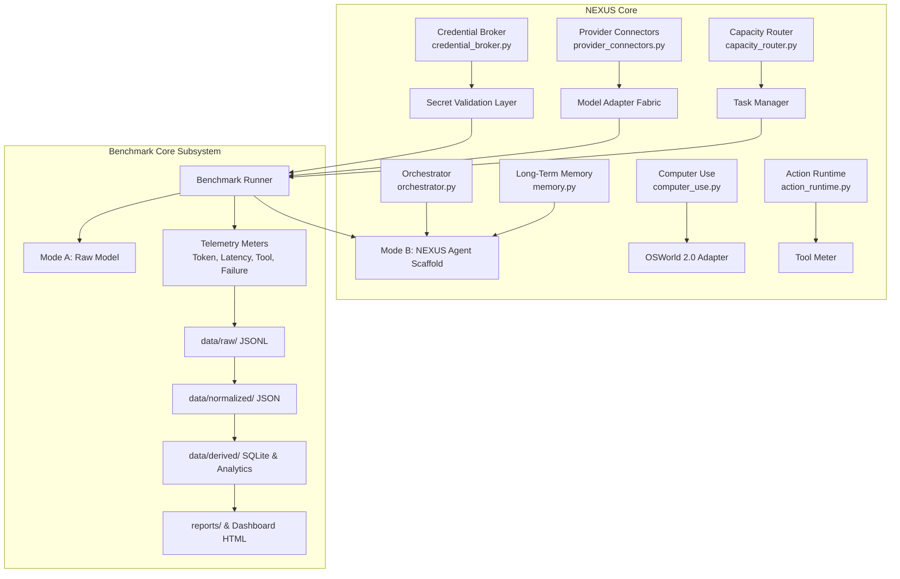

# NEXUS — Frontier Model Benchmarking & Telemetry Lab
## Architectural Specification & Subsystem Design (v1.0)

---

## 1. Executive Summary & Objectives

The **NEXUS Benchmarking & Telemetry Lab** is a production-grade, reproducible evaluation subsystem built natively into the W1™ NEXUS orchestrator. Its primary objective is the rigorous, independent, and fair comparison of three NVIDIA NIM-accessible frontier models:

1. **Kimi K3** (`moonshotai/kimi-k3`)
2. **Muse** (`meta/muse-glimmer-30b`)
3. **DeepSeek V4 Pro** (`deepseek-ai/deepseek-v4-pro-0813`)

The system measures not only task accuracy and benchmark scores, but also token consumption, latency distributions, tool usage efficiency, failure categories, recovery resilience, and the **NEXUS Agent Uplift** (Mode A: Raw Model vs Mode B: Governed NEXUS Agent).

---

## 2. Integration Points with Existing NEXUS Architecture

NEXUS contains a rich, governed multi-agent and multi-model foundation. The benchmarking subsystem integrates directly into existing modules without disrupting core contracts:



### Specific Integration Touchpoints:
1. **`w1cip.provider_connectors`**: Reuses `UrllibTransport`, `ConnectorConfig`, and `TokenUsage` primitives for zero-external-dependency TLS communication with NVIDIA's OpenAI-compatible endpoint.
2. **`w1cip.credential_broker`**: Reuses secret resolution protocols to ensure zero credential leakage into logs, telemetry, or artifacts.
3. **`w1cip.orchestrator` & `w1cip.action_runtime`**: Serves as the backbone for **Mode B (NEXUS Agent)** execution, providing structured planning, action approval, and recovery.
4. **`w1cip.computer_use`**: Supplies headless desktop interaction, screenshot capturing, and coordinate action routing for **OSWorld 2.0**.
5. **`w1cip.real_intelligence_benchmark`**: Extends the existing Trial and Aggregation models with strict failure taxonomies, microsecond latency meters, and provenance tracking.

---

## 3. Model Adapter Architecture

The model adapter layer provides a uniform, provider-neutral abstraction over NVIDIA NIM endpoints:

```text
ModelAdapter (Base Protocol)
├── KimiK3Adapter           (moonshotai/kimi-k3)
├── MuseAdapter             (meta/muse-glimmer-30b)
└── DeepSeekV4ProAdapter    (deepseek-ai/deepseek-v4-pro-0813)
```

### 3.1 Interface Contract
Each adapter implements:
- `generate(prompt: str, system_prompt: str | None, config: ModelRunConfig) -> ModelResponse`
- `stream(prompt: str, system_prompt: str | None, config: ModelRunConfig) -> Iterator[ModelStreamChunk]`
- `tool_call(prompt: str, tools: Sequence[ToolDefinition], config: ModelRunConfig) -> ModelResponse`
- `multimodal_input(prompt: str, images: Sequence[ImageInput], config: ModelRunConfig) -> ModelResponse`
- `structured_output(prompt: str, schema: dict[str, Any], config: ModelRunConfig) -> ModelResponse`
- `usage() -> CumulativeTokenUsage`
- `health_check() -> HealthCheckResult`

### 3.2 Normalized Response Schema
```json
{
  "model": "deepseek-ai/deepseek-v4-pro-0813",
  "provider": "nvidia",
  "input_tokens": 142,
  "output_tokens": 389,
  "reasoning_tokens": null,
  "cached_tokens": 0,
  "total_tokens": 531,
  "latency_ms": 1184.2,
  "time_to_first_token_ms": 284.0,
  "tool_calls": 0,
  "finish_reason": "stop",
  "error": null,
  "is_estimated": false
}
```

> [!IMPORTANT]
> **Measurement Integrity Rule**: If the provider endpoint does not expose a metric (such as reasoning tokens), it is stored strictly as `null` (or `"unavailable"`). Never fabricate or infer hidden reasoning tokens from output length. Any estimated value must be segregated into `estimated_metrics` with `is_estimated = true`.

---

## 4. API Key Security & Secret Hygiene

1. **Storage**: API keys are passed strictly through environment variables:
   - `NVIDIA_API_KEY`: Global default key for NVIDIA endpoints.
   - `NVIDIA_API_KEY_KIMI`: Model-specific override for Kimi K3.
   - `NVIDIA_API_KEY_MUSE`: Model-specific override for Muse.
   - `NVIDIA_API_KEY_DEEPSEEK`: Model-specific override for DeepSeek V4 Pro.
   - Optional encrypted `.env` located in the project root, strictly excluded in `.gitignore`.
2. **Startup Secret Validation (`PreflightValidator`)**:
   - Checks presence and format (`nvapi-*`).
   - Masks values in memory (e.g. `nvapi-...abcd`).
   - Aborts immediately if required keys are missing when entering Live Mode.
3. **Leak Prevention**:
   - Telemetry schemas explicitly reject keys containing `api_key`, `secret`, `bearer`, or `authorization`.
   - Wire headers are sanitized before entering the audit log.

---

## 5. Benchmark Suite Architecture

Each benchmark is isolated in its own module under `benchmarks/` and emits the standard `NormalizedBenchmarkRunRecord`:

```text
benchmarks/
├── automationbench/        (6 enterprise domains: Sales, Marketing, Ops, Support, Finance, HR)
├── osworld2/               (Official osworld-v2-2026.08.08 release, desktop/web/office)
├── terminalbench4/         (TB 4.0 CLI & systems operations)
├── terminalbench_science/  (70 tasks: Life, Physical, Earth, Math, Engineering)
├── frontiermath_tier4/     (High-difficulty research math with confidence intervals)
├── exploitbench/           (Isolated sandbox cybersecurity analysis & patching)
├── srebench/               (Strict 1-attempt incident resolution)
├── mrcr_v2/                (Multi-Round Context Retrieval: 512K, 768K, 1M tiers)
└── aa_intelligence_index/  (Composite methodology & component normalization)
```

### Benchmark Details & Pinning:
| Benchmark | Release / Version | Isolation & Environment | Specific Metrics |
|---|---|---|---|
| **AutomationBench** | `v1.2-public` | Local workflow runner | Domain success, tokens/task, tool calls |
| **OSWorld 2.0** | `osworld-v2-2026.08.08` | Virtual display / Docker sandbox | Trajectory screenshots, steps, action latency |
| **Terminal-Bench 4.0** | `v4.0.1` | Isolated pty / temporary workspace | Tool execution time, command success |
| **TB Science 0.1** | `v0.1.0` | 70 curated scientific problems | Domain accuracy, scientific reasoning depth |
| **FrontierMath Tier 4** | `v2.0` | Formal verification / zero question leak | Accuracy, 95% Clopper-Pearson CI |
| **ExploitBench** | `v1.0-sandbox` | Network-isolated container sandbox | Exploit detection, vulnerability remediation |
| **SRE-Bench** | `v1.1` | Fault injection cluster simulation | Strict `attempts=1`, TTFR, MTTR |
| **MRCR v2** | `v2.0` | Needle-in-haystack context generator | 512K/768K/1M retrieval accuracy, scaling curve |
| **AA Intelligence Index**| `v4.1.1` | Multi-test official aggregator | Unweighted/weighted composite index |

---

## 6. Benchmark Core Subsystem (`src/w1cip/benchmark_core/`)

```text
benchmark_core/
├── runner.py               # Matrix runner with resume & worker concurrency
├── task_manager.py         # Task registry, ordering, filtering, dependencies
├── environment_manager.py  # Sandboxing, env isolation, and env hashing
├── model_adapter.py        # Base adapter, KimiK3, Muse, DeepSeekV4
├── token_meter.py          # High-precision prompt/completion/reasoning metering
├── latency_meter.py        # TTFT, TTLT, Model Time, Tool Time, percentiles
├── tool_meter.py           # Tool invocation count, success rate, recovery rate
├── retry_manager.py        # Bounded retries or strict attempts=1 policy
├── timeout_manager.py      # Granular per-step and per-task timeouts
├── result_validator.py     # Ground truth evaluation and schema validation
├── provenance_tracker.py   # Immutable SHA-256 signatures, git commit, OS metadata
├── artifact_manager.py     # data/raw, data/normalized, data/derived, data/artifacts
└── report_generator.py     # HTML dashboards, executive summaries, CSV matrices
```

### Immutable Run Record Schema (`data/raw/<run_id>.jsonl`):
```json
{
  "run_id": "run-20260906-nv-deepseek-tb4-001",
  "benchmark": "terminalbench4",
  "benchmark_version": "4.0.1",
  "task_id": "tb4-sys-042",
  "model": "deepseek-ai/deepseek-v4-pro-0813",
  "provider": "nvidia",
  "mode": "MODE_B_NEXUS_AGENT",
  "attempt": 1,
  "max_attempts_allowed": 1,
  "success": true,
  "score": 1.0,
  "input_tokens": 2840,
  "output_tokens": 612,
  "reasoning_tokens": null,
  "cached_tokens": 0,
  "total_tokens": 3452,
  "tool_calls": 4,
  "successful_tool_calls": 4,
  "failed_tool_calls": 0,
  "latency_ms": 4210.5,
  "time_to_first_token_ms": 320.0,
  "model_time_ms": 3100.0,
  "tool_time_ms": 1110.5,
  "retries": 0,
  "failure_type": null,
  "failure_reason": null,
  "timestamp": "2026-09-06T20:45:12Z",
  "environment_hash": "sha256:e3b0c44298fc1c149afbf4c8996fb92427ae41e4649b934ca495991b7852b855",
  "nexus_git_commit": "0.1.0.dev52",
  "runner_version": "1.0.0"
}
```

---

## 7. Mode A vs Mode B Evaluation (NEXUS Uplift)

Every benchmark in the matrix is evaluated in two distinct configurations:

```text
Mode A: Raw Model Evaluation
Task Prompt ─────────► Model ─────────► Raw Output ─────────► Ground Truth Evaluator

Mode B: NEXUS Governed Agent Evaluation
Task Prompt ─────────► Planner (W1) ─────────► Tool Router / Action Runtime
                            ▲                                │
                            │                                ▼
                     Long-Term Memory ◄────────────── Tool Execution
                            │                                │
                            ▼                                ▼
                        Verifier ◄──────────────────── Candidate Output
                            │
                            ▼
                    Final Attested Result ───────────► Ground Truth Evaluator
```

### Metrics Quantified:
- **Absolute Uplift**: $\Delta_{\text{abs}} = \text{Score}_{\text{Mode B}} - \text{Score}_{\text{Mode A}}$
- **Relative Uplift**: $\Delta_{\text{rel}} = \frac{\text{Score}_{\text{Mode B}} - \text{Score}_{\text{Mode A}}}{\text{Score}_{\text{Mode A}}} \times 100\%$
- **Token Overhead Ratio**: $\frac{\text{Tokens}_{\text{Mode B}}}{\text{Tokens}_{\text{Mode A}}}$
- **Cost of Uplift**: Cost in USD per percentage point gained.

---

## 8. Failure Taxonomy & Classification Rules

Every failed task execution must be classified into exactly one root category:
- `MODEL_ERROR`: Model generated hallucinated, syntactically invalid, or structurally non-compliant output.
- `WRONG_REASONING`: Model produced valid output structure but incorrect answer/logic.
- `TOOL_ERROR`: Tool execution failed (e.g. exit code non-zero, script crashed).
- `TIMEOUT`: Execution exceeded per-task or per-step timeout.
- `ENVIRONMENT_ERROR`: Sandbox startup failed, OS error, missing dependency.
- `PROVIDER_ERROR`: HTTP 5xx error or upstream NVIDIA infrastructure outage.
- `RATE_LIMIT`: HTTP 429 Too Many Requests.
- `CONTEXT_LIMIT`: Input prompt or intermediate history exceeded model context window.
- `PARSER_ERROR`: Output could not be decoded or deserialized.
- `HARNESS_ERROR`: Benchmark harness bug or validation script error.
- `UNKNOWN`: Unclassified failure.

---

## 9. Interactive Telemetry Dashboard Architecture

The dashboard is generated as a standalone, zero-external-dependency HTML5 application located in `reports/dashboard.html` with:
- **Rich Aesthetic**: Dark glassmorphism (`#0B0F17` base, `#1E293B` cards, neon accent gradients, Inter font).
- **Interactive Visualizations**:
  1. **Leaderboard**: Filterable table with Overall Score, Tokens/1M, Latency (p95), Tool Reliability, and Efficiency Index.
  2. **Benchmark Comparison**: Grouped bar chart comparing Kimi K3, Muse, and DeepSeek V4 Pro across all 9 benchmarks.
  3. **Token Efficiency Scatter**: $X = \text{Total Tokens}$, $Y = \text{Score}$.
  4. **Quality vs Cost Scatter**: $X = \text{Cost per Task (\$)}$, $Y = \text{Success Rate (\%)}$.
  5. **Latency Distribution**: Percentiles (Median, p90, p95, p99).
  6. **8-Axis Radar Chart**: Reasoning, Coding, Agentic, Computer Use, Science, Long Context, Reliability, Efficiency.
  7. **Stacked Failure Analysis**: Breakdown by failure taxonomy.
  8. **Long-Context Scaling Curves**: MRCR v2 performance across 512K, 768K, and 1M tokens.
  9. **Domain Heatmap**: Normalized score matrix across all benchmark domains.

---

## 10. Preflight Verification & Smoke-Test Strategy

Before entering the full benchmark matrix, the system enforces a strict 2-stage qualification gate:

```text
Stage 1: Preflight Verification Gate
├── Secret Validation (presence, prefix check, masking)
├── Provider Health Check (NVIDIA endpoint TLS handshake & latency)
├── Model Availability Probe (ping each of the 3 models with a 5-token ping)
├── Token Meter Audit (confirm prompt & completion token fields are returned)
├── Tool Call Capability Probe (verify function calling protocol)
├── Structured Output Probe (verify JSON schema enforcement)
└── Storage & Artifact Audit (verify data/ directories are writable)

Stage 2: Benchmark Smoke-Test Gate
├── AutomationBench Smoke: 1 tiny CRM contact lookup task
├── OSWorld 2.0 Smoke: 1 headless browser navigation task
├── Terminal-Bench 4.0 Smoke: 1 file manipulation & regex task
├── TB Science Smoke: 1 formula calculation task
├── FrontierMath Tier 4 Smoke: 1 proof verification task
├── ExploitBench Smoke: 1 mock input-sanitization check
├── SRE-Bench Smoke: 1 mock service restart task
├── MRCR v2 Smoke: 1 small needle-in-haystack retrieval (16K context)
└── AA Intelligence Index Smoke: 1 composite aggregation check
```

Only when all 7 preflight checks and 9 benchmark smoke tests pass with 100% success is the full matrix unlocked.
